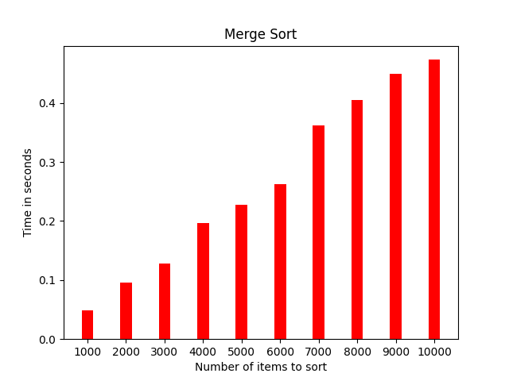

# A Comparison of Sorting Algorithms
### In this project I compare a couple sorting algorithms and graph their time, read and write complexities as the size of the data that is being sorted increases.
Here is an example output graph from the program showing the reads and writes made by using merge sort. 
  
This bar chart is showing the amount of time that the program takes to sort the data using merge sort.

Under the hood this is all being run by a python engine that compiles and runs the cpp program that does the sorting and prints the data out to data files. The data is in turn opened by the python which then uses matplotlib and pandas to process it.

