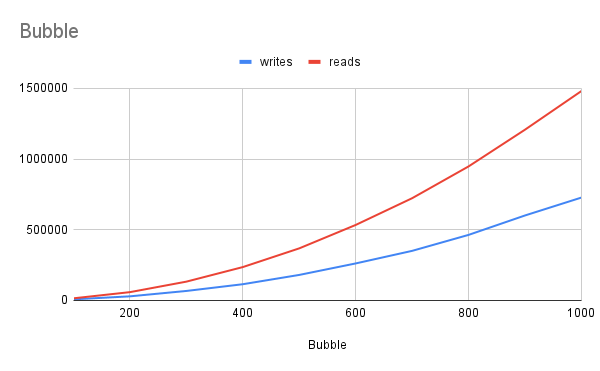
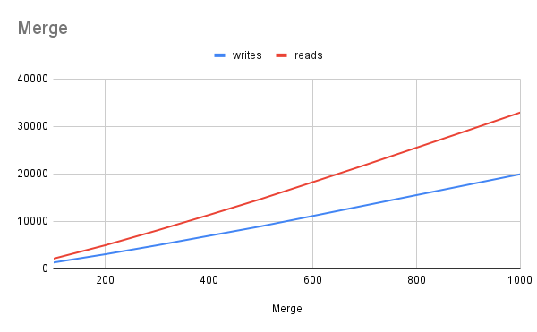
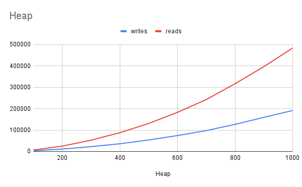
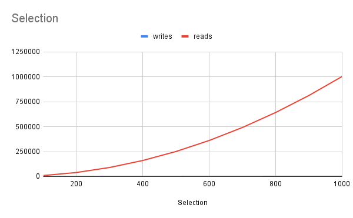

# Project 4 Report

Answer the following prompts directly in this file:
* Information about your dataset (you will be assigned a different grader for this project).

  * My Dataset includes all the airports under FAA control (including some airports in Canada and the Caribbean)

* Analyze the data. Graph the number of reads and writes for each sorting algorithm and look at how the number of reads and writes grows when the size of the data set grows. Compare and contrast the different sorting algorithms and draw conclusions about which sorting algorithms are more efficient. Discuss complexities and their effects.
  *   
  This graph does a great job showing that the time complexity of Bubble sort is O(n2). You can see in the graph that both the number of reads and writes increases exponentialy to the point that when 1000 items are being sorted there are 1.5MM reads.
  *   
    This graph shows that Merge sort is O(n Log n) time complexity. While not the fastest, one can easily see that the number of reads and writes performed are much less than bubble sort.
  *   
    This graph shows that Heap sort is O(n Log n) time complexity. One can also see that the number of reads performed is slightly more than the number of reads made by merge sort, and the graph is slightly more convex showing that the reads and writes are growing at a slightly faster rate.  
  *   
  This graph shows that selection sort is O(n2) time complexity, especially for the reads. While comparing just the number of read opperations to bubble sort, Selection is only a bit more efficent, but the total number of operations is much less, because the number of writes is significantly less complex.

* Look at the output from the stabilityTest function and answer the following questions:
  * How are the names sorted by default?
    * By default, the names are sorted alphabetically by first name
  * How is the output from the two stable sorting algorithms different from the two unstable ones? Be specific in your answer, and use what you know about how each sorting algorithm works to justify your observations.
    * Both of the stable sorting algorithms (bubble, and merge) preserve the alphabetic ordering by first name within the names that share the same last name. The reason that the ordering is not preserved in heap sort is because when the heap is rotated, the items may not stay in the order they were inserted in. Selection doesn't preserve the order because when a swap occurs there is no preservation of order.
* Answers to the following questions: 
  * If you need to sort a contacts list on a mobile app, which sorting algorithm(s) would you use and why? 
    * First I would use a quick unstable sorting algorithm to sort the first names like unstable quick sort, then I would use a stable algorithm to sort by last name with a stable algorithm like quick stable
  * What about if you need to sort a database of 20 million client files that are stored in a datacenter in the cloud?
    * As long as there is no reason to need a multi-layered sort, the best option would be to just use quick sort (unstable).

Shuffle code from https://www.educba.com/c-plus-plus-shuffle/

**Note: Any code that was not authored by yourself or the instructor must be cited in your report. This includes the use of concepts not taught in lecture.**